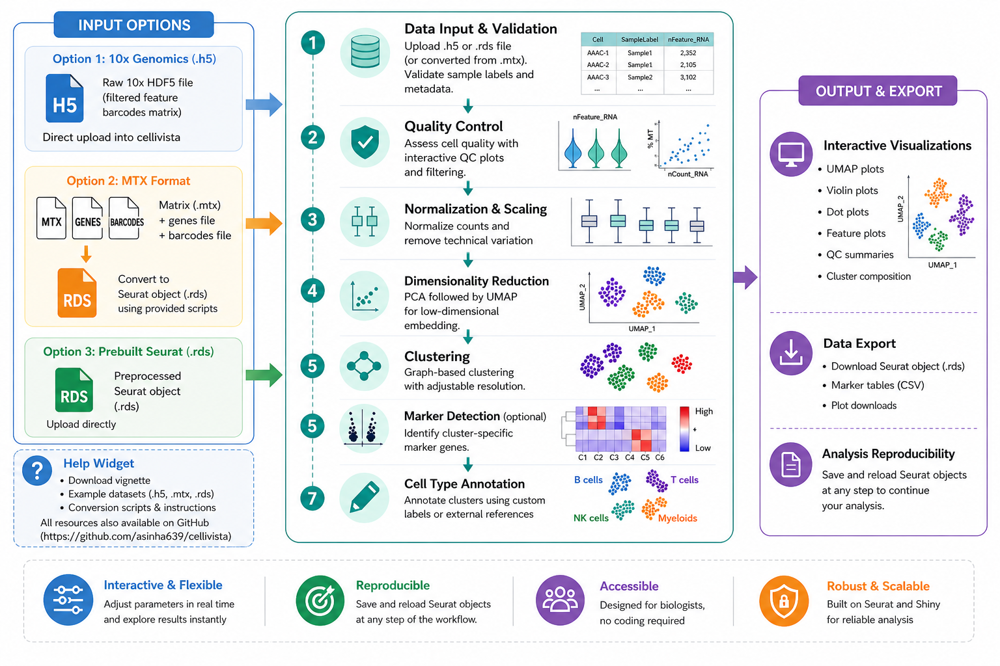

# cellivista

<p align="center">
  
</p>

<p align="center">
<b>cellivista</b> is an open-source R/Shiny web application that provides an end-to-end Seurat-based workflow for single-cell RNA-seq analysis.
</p>

<p align="center">
<a href="https://au-cbgm-shiny.augusta.edu/cellivista/"></a>


<a href="https://doi.org/10.5281/zenodo.21511556"></a>
</p>

## Overview

`cellivista` provides a guided browser-based workflow for preprocessing, quality control, integration, clustering, marker identification, annotation, and visualization of single-cell RNA-seq datasets. Rather than introducing new analytical algorithms, `cellivista` exposes established Seurat- and DoubletFinder-based workflows through an interactive graphical interface, allowing researchers to perform reproducible analyses without writing R code.

The application supports:

- 10x Genomics HDF5 (`.h5`) files
- Existing Seurat (`.rds`) objects
- Matrix Market (`.mtx`) datasets with barcode and feature files
- Export and reload of intermediate Seurat objects throughout the workflow

## Live application

**https://au-cbgm-shiny.augusta.edu/cellivista/**

## Running cellivista locally

```bash
git clone https://github.com/asinha639/cellivista.git
cd cellivista
```

```r
install.packages(c(
  "shiny","Seurat","ggplot2","dplyr","Matrix",
  "patchwork","purrr","readr","future",
  "shinyWidgets","shinyBS","tibble","tidyr"
))
```

Install DoubletFinder following its official installation instructions.

```r
shiny::runApp(".")
```
## Testing

`cellivista` includes an automated unit test suite built with `testthat`. The tests use small synthetic datasets to validate the application's core analysis functions, input validation, and error handling without requiring external datasets.

Run the tests locally:

```r
testthat::test_dir("tests/testthat")
```

The test suite is also executed automatically on every push and pull request using GitHub Actions.

## Workflow

1. Import `.h5`, `.rds`, or Matrix Market data
2. Compute quality-control metrics
3. Filter low-quality cells
4. Detect and remove doublets
5. Integrate multiple samples
6. Perform clustering and UMAP visualization
7. Identify cluster marker genes
8. Annotate cell populations
9. Generate publication-quality visualizations
10. Export Seurat objects, plots, and marker tables



## Repository structure

```text
Cellivista/
├── .github/
├── tests/
├── R/
├── paper/
├── docs/
├── inst/
├── www/
├── app.R
├── README.md
├── LICENSE
└── CITATION.cff
```

## Example data

Example data and annotation templates are included in `inst/extdata/`. The repository also contains instructions for obtaining the PBMC benchmark dataset (GSE132044).

## Outputs

- Seurat objects (.rds)
- UMAP plots
- QC plots
- FeaturePlots
- Dot plots
- Violin plots
- Marker tables (.csv)

## Documentation

- `docs/cellivista_vignette.pdf`
- `paper/paper.md`

## Citation

Please cite `cellivista` using the included `CITATION.cff` file or the archived software DOI:

**https://doi.org/10.5281/zenodo.21511557**

## License

MIT License.

## Acknowledgements

`cellivista` builds upon the Seurat ecosystem for single-cell RNA-seq analysis and uses the Shiny framework to provide an accessible graphical interface for reproducible research.
